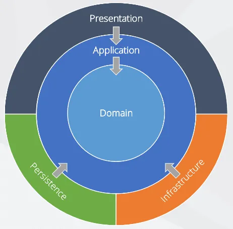

# 양파 아키텍처/양파 구성법 (Onion Architecture)

(Image by [Daniel Rusnok](https://dev.to/danielrusnok))

가운데에 있는 레이어는 바깥에 있는 레이어에 접근할 수 없고, 오직 필요한 인터페이스만을 규정한다.
바깥쪽에 있는 레이어는 해당 인터페이스를 구현해 안쪽 레이어에 제공함으로써, 의존성 역전(Dependency Inversion)을 이룬다.

## 장점

- 인프라 구성의 변경, 외부 인터페이스의 변경 등이 발생하더라도 핵심 도메인 로직에 영향을 끼치지 않는다.
- 관심사를 분리(Separation of Concerns)해 유지보수를 편리하게 만든다.
- 인터페이스 분리가 강제되므로 테스트가 용이하다.
